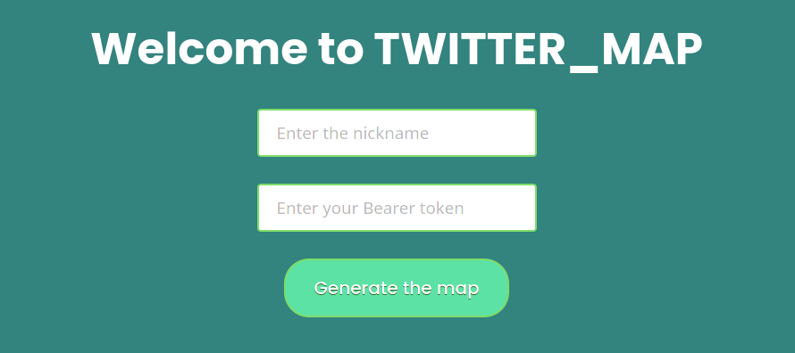
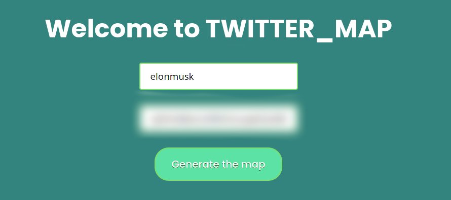
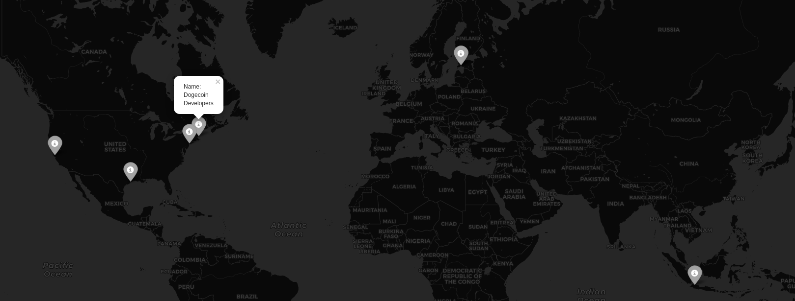

# Twitter Map
***Films_map*** is a website for generating the map with person`s, whose nickname is given by user in form, friend on Twitter relating to their location
[Website link] (http://bohdanmykhayliv.pythonanywhere.com/)

## Main folders 
- **templates** -- folder with all html templates
- **static** -- folder with static files (.css in this case)

## Main files
- **app.py** -- main module of program, written using Flask framework
- **back_end.py** -- module with all the logic of the program

## How it works?
Each time when user visit website, user will be asked to enter ***user`s nickname*** (*without @ at the beginning*) and its personal ***Bearer token***.

After, user enter the data.

To procced user should press "**Generate the map**".
*Generating map might take up to 1 min.*

### Result
After generating map user will see a HTML-page which represents map with user`s friends location points and their names on markers.

